# RE:ROOM AI - Interior Designer

## AI-Powered Interior Design, Augmented Reality, Spatial Intelligence, Shopping, and Construction Planning 

RE:ROOM AI is a React Native / Expo mobile application designed to turn a user's real physical space into an interactive AI design environment.

Instead of treating interior design as a static image-generation problem, RE:ROOM AI connects the entire journey:

**Capture → Understand → Design → Visualize → Edit → Shop → Build**

The application combines multimodal AI, computer vision, AR, room measurement, spatial reasoning, product discovery, construction planning, contractor quote workflows, and mobile-first UX inside one experience.


---

# Table of Contents

* [1. Product Overview](#1-product-overview)
* [2. Vision](#2-vision)
* [3. Core Product Loop](#3-core-product-loop)
* [4. Problem](#4-problem)
* [5. Solution](#5-solution)
* [6. Key Features](#6-key-features)
* [7. Product Differentiation](#7-product-differentiation)
* [8. High-Level Architecture](#8-high-level-architecture)
* [9. Mobile Architecture](#9-mobile-architecture)
* [10. AI Architecture](#10-ai-architecture)
* [11. AR Architecture](#11-ar-architecture)
* [12. Multimodal Pipeline](#12-multimodal-pipeline)
* [13. Room Understanding](#13-room-understanding)
* [14. AI Interior Designer](#14-ai-interior-designer)
* [15. Natural Language Editing](#15-natural-language-editing)
* [16. AR Furniture Placement](#16-ar-furniture-placement)
* [17. Room Measurements](#17-room-measurements)
* [18. Shopping and Commerce](#18-shopping-and-commerce)
* [19. Construction Quote Intelligence](#19-construction-quote-intelligence)
* [20. Monetization](#20-monetization)
* [21. Data Architecture](#21-data-architecture)
* [22. API Architecture](#22-api-architecture)
* [23. Repository Structure](#23-repository-structure)
* [24. State Management](#24-state-management)
* [25. Offline and Synchronization](#25-offline-and-synchronization)
* [26. Authentication and Authorization](#26-authentication-and-authorization)
* [27. Privacy and Security](#27-privacy-and-security)
* [28. AI Safety](#28-ai-safety)
* [29. Performance](#29-performance)
* [30. Accessibility](#30-accessibility)
* [31. Testing](#31-testing)
* [32. Environment Configuration](#32-environment-configuration)
* [33. Local Development](#33-local-development)
* [34. Mobile Build Strategy](#34-mobile-build-strategy)
* [35. Production Deployment](#35-production-deployment)
* [36. Observability](#36-observability)
* [37. Failure Recovery](#37-failure-recovery)
* [38. Unsupported AR Devices](#38-unsupported-ar-devices)
* [39. AI Cost Controls](#39-ai-cost-controls)
* [40. Feature Flags](#40-feature-flags)
* [41. Construction Estimate Disclaimer](#41-construction-estimate-disclaimer)
* [42. Roadmap](#42-roadmap)
* [43. Contribution Guide](#43-contribution-guide)
* [44. Product Philosophy](#44-product-philosophy)
* [45. Final Architecture Summary](#45-final-architecture-summary)

---

# 1. Product Overview

RE:ROOM AI is a mobile-first spatial intelligence application.

The application starts with the physical environment rather than requiring users to manually construct a digital representation.

A typical workflow is:

1. Open the mobile application.
2. Capture a room.
3. Let the AI understand the space.
4. Describe the desired outcome.
5. Generate multiple design concepts.
6. Refine the result through natural language.
7. Enter AR mode.
8. Place furniture inside the real room.
9. Measure and validate spatial relationships.
10. Discover purchasable objects.
11. Convert design intent into a construction scope.
12. Request construction quotes.
13. Compare and review quotes.
14. Export or share the project.

The core product idea is:

> **The real room becomes the interface for AI.**

---

# 2. Vision

The long-term goal is to create a spatial intelligence layer for the home.

Instead of separate apps for:

* inspiration;
* design;
* room measurement;
* AR visualization;
* product discovery;
* shopping;
* renovation planning;
* contractor communication;

RE:ROOM AI connects all of them around the user's real-world space.

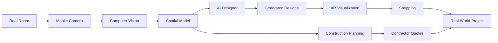

The ultimate workflow is:

**See → Imagine → Visualize → Decide → Buy → Build**

---

# 3. Core Product Loop

The core user experience intentionally avoids unnecessary complexity.

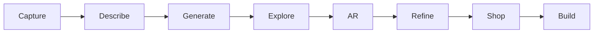

## Capture

The user photographs the room.

## Describe

The user communicates intent:

* "Make it warmer."
* "Keep my sofa."
* "Add better lighting."
* "Make it look more expensive."
* "Keep the budget under $2,000."

## Generate

The AI creates design concepts.

## Explore

The user compares several variations.

## AR

The user views furniture and designs inside the actual environment.

## Refine

The user changes the design conversationally.

## Shop

The user discovers matching or alternative products.

## Build

The user can turn the design into an editable renovation scope and quote workflow.

---

# 4. Problem

Interior design is fragmented.

Users often jump between:

* Pinterest-like inspiration tools;
* image-generation systems;
* furniture websites;
* floor-planning applications;
* camera apps;
* measuring tools;
* spreadsheets;
* contractor directories;
* messaging applications.

This creates several problems.

## Visualization

A beautiful generated room may not fit the user's physical environment.

## Spatial uncertainty

The user may not know whether:

* the sofa fits;
* a table blocks circulation;
* a cabinet fits against the wall;
* a rug is appropriately sized;
* a piece is proportionally correct.

## Shopping fragmentation

A concept may contain objects that are difficult to identify or purchase.

## Construction fragmentation

A visual concept typically stops before the actual renovation workflow.

RE:ROOM AI attempts to connect all of these steps.

---

# 5. Solution

The product unifies several layers.

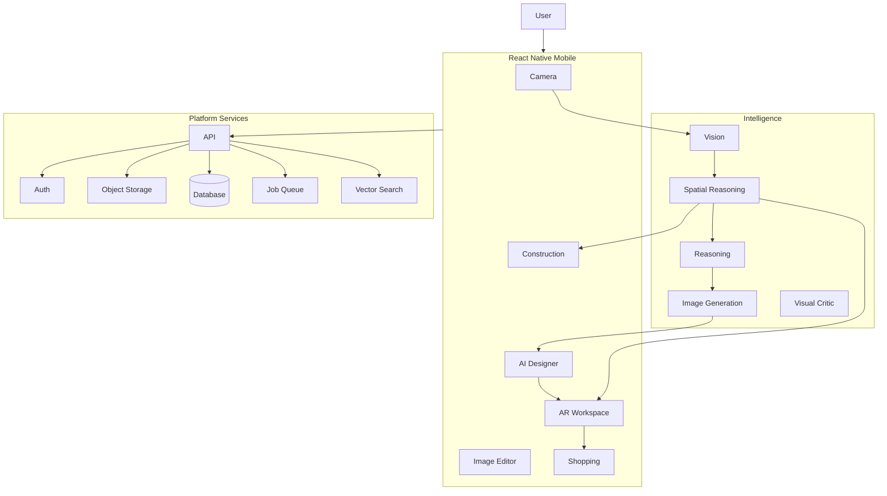

---

# 6. Key Features

## 6.1 AI Interior Designer

The AI understands:

* room type;
* furniture;
* architecture;
* materials;
* colors;
* lighting;
* style;
* budget;
* user preferences;
* spatial constraints.

## 6.2 AR Furniture Placement

Users can:

* scan surfaces;
* place furniture;
* move objects;
* rotate objects;
* resize objects;
* lock objects;
* compare layouts.

## 6.3 AI Natural Language Editing

Examples:

> "Make the sofa smaller."

> "Try warmer wood."

> "Move the table closer to the window."

> "Add a reading chair."

> "Give me a minimalist version."

## 6.4 Room Measurements

The system can derive planning-oriented measurements for:

* floors;
* walls;
* openings;
* furniture;
* clearance.

## 6.5 Shopping

Design objects can become product discovery opportunities.

## 6.6 Construction Quotes

Measured room information can become:

* renovation scope;
* materials;
* labor assumptions;
* allowances;
* contractor requests;
* quote comparison.

---

# 7. Product Differentiation

Many interior AI products are fundamentally:

> **image generators with an interior-design prompt.**

RE:ROOM AI is designed as:

> **a persistent spatial workspace around the user's real room.**

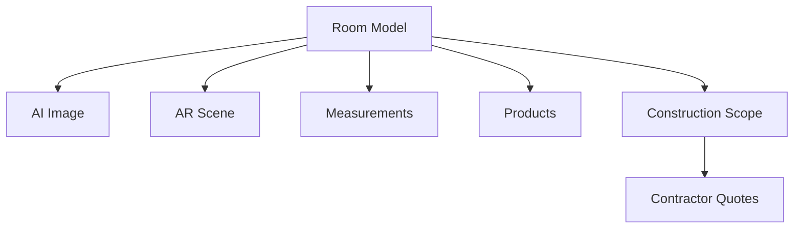

This allows one room to support multiple product workflows.

---

# 8. High-Level Architecture

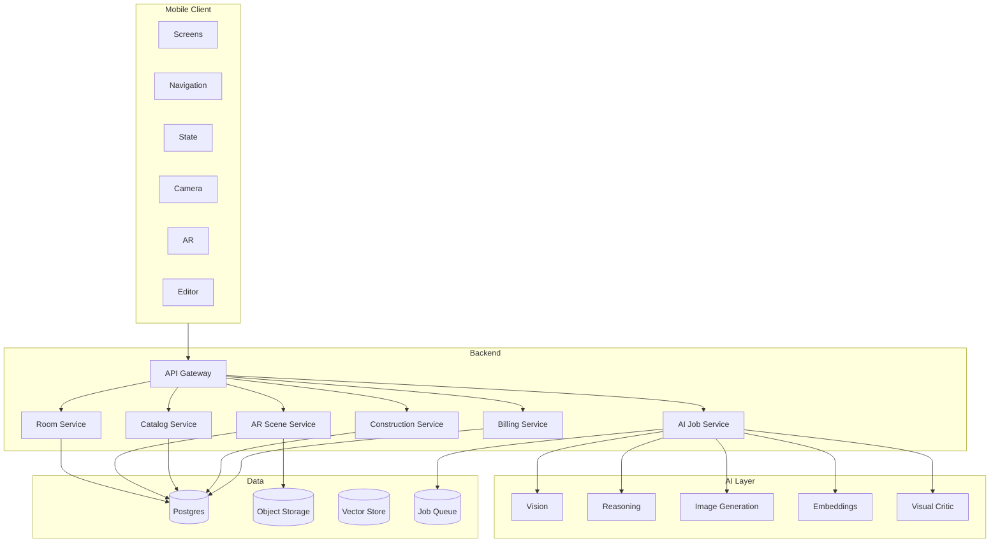

---

# 9. Mobile Architecture

RE:ROOM AI should maintain a clean separation between application layers.

Recommended:

```text
src/
├── api/
├── ai/
├── ar/
├── auth/
├── billing/
├── camera/
├── commerce/
├── construction/
├── editor/
├── navigation/
├── notifications/
├── screens/
├── state/
├── storage/
├── types/
└── utils/
```

The mobile application should contain:

* UI;
* state;
* platform capability adapters;
* local persistence;
* request orchestration.

Business logic that requires authorization should live server-side.

---

# 10. AI Architecture

Do not depend on one giant prompt.

Use specialized AI responsibilities.

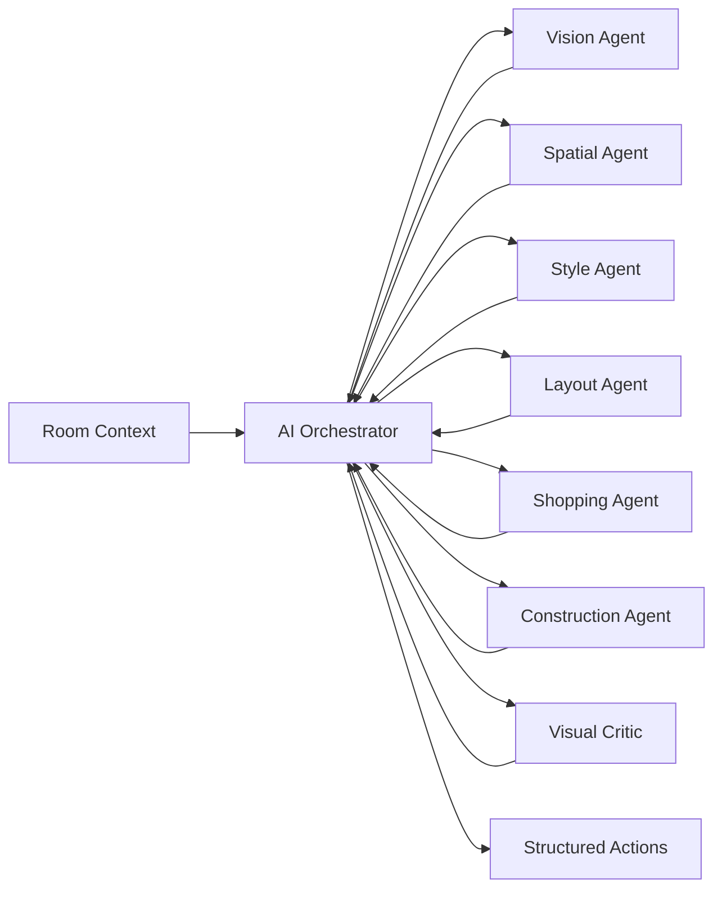

This architecture enables deterministic validation.

---

# 11. AR Architecture

AR should live behind an abstraction.

```ts
export interface ARSessionAdapter {
  start(): Promise<void>;
  pause(): Promise<void>;
  stop(): Promise<void>;
  hitTest(x: number, y: number): Promise<ARAnchor | null>;
  addAnchor(anchor: ARAnchor): Promise<void>;
  removeAnchor(id: string): Promise<void>;
  getPlanes(): Promise<ARPlane[]>;
}
```

The implementation can map to:

* ARKit;
* ARCore;
* native development builds;
* test adapters.

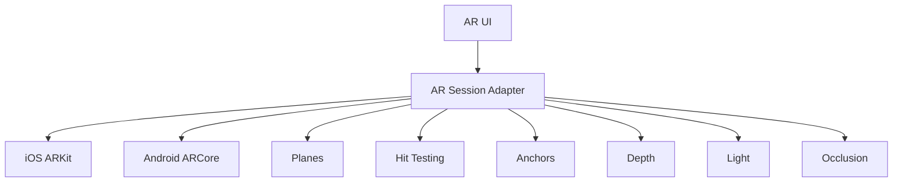

---

# 12. Multimodal Pipeline

A room can produce multiple information streams.

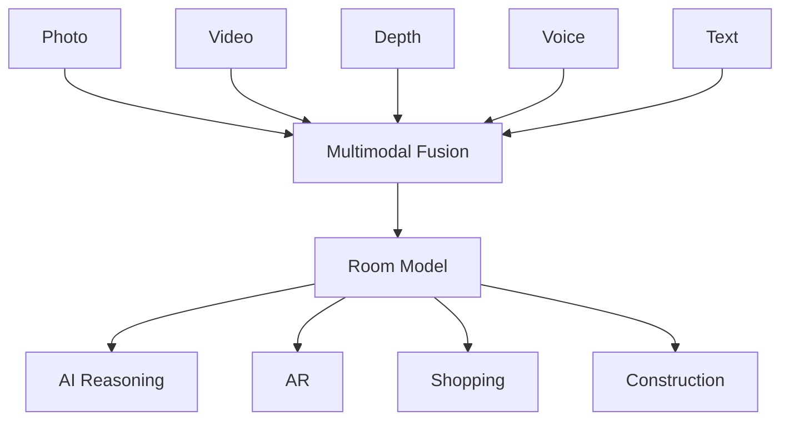

This enables richer understanding than a single image.

---

# 13. Room Understanding

The central domain object is the room model.

```ts
export interface RoomModel {
  id: string;

  roomType?: string;

  dimensions?: {
    widthM: number;
    depthM: number;
    heightM: number;
  };

  objects: RoomObject[];

  surfaces: RoomSurface[];

  openings: RoomOpening[];

  lighting?: LightingModel;

  style?: {
    primary?: string;
    secondary?: string;
  };
}
```

Object example:

```ts
export interface RoomObject {
  id: string;
  category: string;
  confidence: number;
  preserve: boolean;
  material?: string;
  color?: string;
  transform?: ARTransform;
}
```

---

# 14. AI Interior Designer

The AI converts user intent into structured design intent.

Example input:

```text
Make my living room warmer and more modern.

Keep my sofa.

Replace the coffee table.

Add more lighting.

Stay under $2,000.
```

Structured result:

```json
{
  "style": {
    "primary": "warm-modern"
  },
  "preserve": [
    "sofa"
  ],
  "replace": [
    "coffee-table"
  ],
  "add": [
    "floor-lamp"
  ],
  "budget": 2000
}
```

A structured intent layer allows every downstream service to reuse the same request.

---

# 15. Natural-Language Editing

The user should be able to refine designs conversationally.

Examples:

```text
"Move the sofa left."

"Make the rug lighter."

"Use more natural wood."

"Add a floor lamp."

"Give me a luxury version."

"Make this more Scandinavian."

"Show me three options."

"Keep everything under $1,500."
```

The command parser should return structured operations.

```ts
export interface AIARAction {
  intent:
    | "add"
    | "remove"
    | "move"
    | "resize"
    | "rotate"
    | "style"
    | "replace";

  targetId?: string;

  catalogItemId?: string;

  transform?: Partial<ARTransform>;

  properties?: Record<string, unknown>;
}
```

---

# 16. AR Furniture Placement

The placement pipeline is:

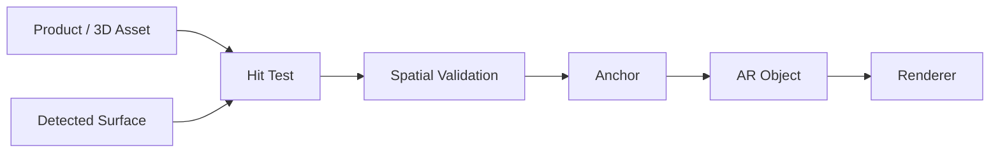

Spatial validation should consider:

* object dimensions;
* surface type;
* available space;
* clearance;
* collision;
* doorway constraints;
* walkway width.

---

# 17. Room Measurements

Measurement features support:

* floor area;
* wall area;
* ceiling area;
* perimeter;
* door dimensions;
* window dimensions;
* furniture footprints;
* walkway dimensions.

Example:

```ts
export function distance3D(
  a: ARVector3,
  b: ARVector3,
) {
  return Math.hypot(
    a.x - b.x,
    a.y - b.y,
    a.z - b.z,
  );
}
```

Measurements should be treated as planning aids.

---

# 18. Spatial Rules

The AI must understand physical constraints.

Example:

```ts
export function clearanceOK(
  distanceM: number,
  requiredM = 0.6,
) {
  return distanceM >= requiredM;
}
```

Examples of domain rules:

* sofa should not block a door;
* cabinet must fit the target wall;
* dining chairs need circulation;
* beds require accessible sides where appropriate;
* rugs should fit the intended furniture grouping;
* large pieces should fit through relevant openings.

These rules make the AI more useful than image generation alone.

---

# 19. Shopping and Commerce

A design object can become a shopping object.

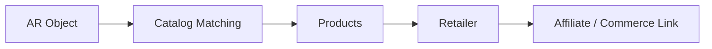

Product schema:

```ts
export interface Product {
  id: string;
  title: string;
  imageUrl: string;
  price: number;
  currency: string;
  retailer: string;
  url: string;
  affiliateUrl?: string;
}
```

---

# 20. Monetization

RE:ROOM AI supports several monetization layers.

## Free

* limited designs;
* basic room capture;
* basic image previews.

## Pro

* advanced AI;
* unlimited design projects;
* HD exports;
* saved rooms;
* shopping intelligence.

## Pro Plus

* AR;
* AI voice commands;
* advanced editing;
* AI video;
* advanced spatial intelligence.

## Business

* multi-user teams;
* client projects;
* construction workflows;
* professional presentation exports;
* white-label options.

## Additional Revenue

* AI credits;
* HD export packs;
* AI video credits;
* professional staging packs;
* affiliate commerce;
* contractor referral opportunities;
* marketplace templates.

---

# 21. Data Architecture

Recommended database relationships:

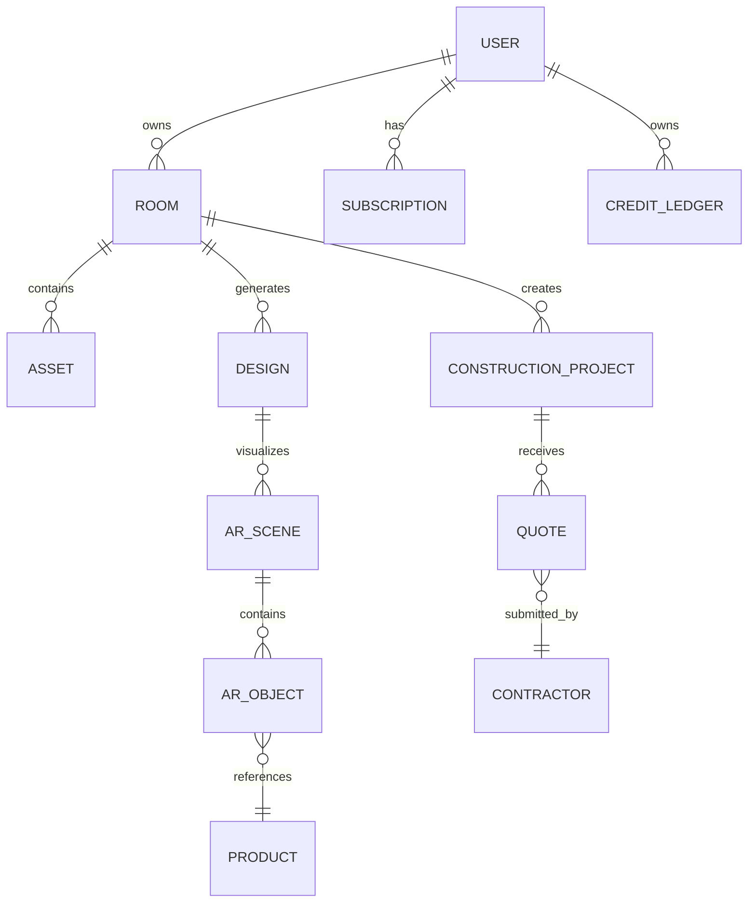

---

# 22. API Architecture

Recommended endpoints:

```text
/v1/auth
/v1/users
/v1/rooms
/v1/assets
/v1/designs
/v1/generations
/v1/ar
/v1/ar/scenes
/v1/ar/objects
/v1/ar/measurements
/v1/catalog
/v1/products
/v1/commerce
/v1/construction
/v1/construction/projects
/v1/construction/scopes
/v1/construction/quotes
/v1/contractors
/v1/billing
/v1/reports
```

API responses should use predictable envelopes.

Example:

```json
{
  "data": {},
  "error": null,
  "requestId": "..."
}
```

---

# 23. Repository Structure

```text
src/
├── ai/
│   ├── agents/
│   ├── context/
│   ├── generation/
│   ├── prompts/
│   ├── tools/
│   └── memory/
│
├── ar/
│   ├── adapters/
│   ├── anchors/
│   ├── collaboration/
│   ├── measurements/
│   ├── placement/
│   ├── rendering/
│   └── scenes/
│
├── camera/
├── commerce/
├── construction/
├── editor/
├── billing/
├── auth/
├── notifications/
├── storage/
├── state/
├── navigation/
├── components/
├── screens/
├── hooks/
├── types/
└── utils/
```

---

# 24. State Management

Separate domain state.

Example:

```ts
interface ApplicationState {
  auth: AuthState;
  rooms: RoomState;
  designs: DesignState;
  ar: ARState;
  construction: ConstructionState;
  commerce: CommerceState;
  billing: BillingState;
}
```

Avoid one massive globally mutable state object.

Use domain-specific stores.

---

# 25. Offline and Synchronization

Mobile environments may lose connectivity.

Support local persistence for:

* room drafts;
* AR transformations;
* generated image references;
* design preferences;
* construction scope edits.

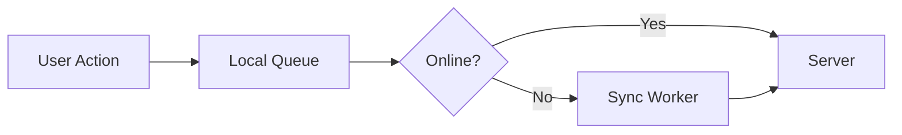

Mutations should have idempotency keys.

---

# 26. Authentication and Authorization

Use authenticated sessions.

Server-side checks should include:

```ts
assertAuthenticated();
assertRoomOwner(userId, roomId);
assertSceneOwner(userId, sceneId);
assertQuoteAccess(userId, quoteId);
assertFeatureEntitled(userId, feature);
```

Never rely only on client-side authorization.

---

# 27. Privacy and Security

The app can process highly contextual room imagery.

Protect:

* uploaded photos;
* videos;
* room layouts;
* user preferences;
* product activity;
* contractor documents.

Use:

* signed storage URLs;
* authenticated APIs;
* encryption in transit;
* scoped access tokens;
* deletion workflows;
* short-lived tokens.

Users should be able to delete their uploaded room assets.

---

# 28. AI Safety

AI model outputs should never directly execute arbitrary code.

Use constrained actions:

```ts
export interface SafeAIAction {
  type:
    | "move"
    | "resize"
    | "add"
    | "remove"
    | "replace"
    | "style";

  targetId?: string;

  values?: Record<string, unknown>;
}
```

Validate every action before execution.

---

# 29. Performance

AR and image generation can consume significant resources.

Optimization strategies:

* level of detail;
* texture resizing;
* image caching;
* model caching;
* object culling;
* progressive loading;
* background jobs;
* upload compression;
* frame throttling.

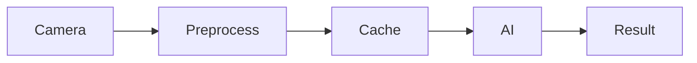

---

# 30. Accessibility

Every interactive element should have:

* accessibility role;
* accessible label;
* sufficient touch target;
* readable text;
* reduced-motion support.

AR should have alternative non-AR workflows.

For example:

```text
AR unavailable
        ↓
3D / 2D visual preview
        ↓
Image-based design editor
        ↓
Shopping
```

This avoids excluding users from the core product.

---

# 31. Testing

## Unit

Test:

* spatial math;
* transformations;
* quote calculations;
* command parsing;
* feature permissions.

## Integration

Test:

* room upload;
* AI generation;
* AR persistence;
* catalog lookup;
* construction scope.

## E2E

Test:

```text
Launch
→ Onboarding
→ Capture
→ Generate
→ AR
→ Edit
→ Shop
→ Construction
→ Export
```

---

# 32. Environment Configuration

Example:

```env
EXPO_PUBLIC_API_URL=https://api.example.com

AI_PROVIDER=provider

OBJECT_STORAGE_BUCKET=room-assets

VECTOR_INDEX=rooms

BILLING_PROVIDER=provider

COMMERCE_PROVIDER=provider
```

Never expose private server secrets to the React Native client.

---

# 33. Local Development

Install dependencies:

```bash
npm install
```

Run Expo:

```bash
npx expo start
```

Then use the project's supported mobile workflow.

For native development builds, use the project's existing scripts.

Examples:

```bash
npm run android
npm run ios
```

Do not assume these scripts exist; inspect `package.json`.

---

# 34. Mobile Build Strategy

RE:ROOM AI should be validated on physical devices whenever possible.

AR requires native device capabilities.

Recommended matrix:

| Platform       | Core Mobile |          AR |   Camera |       AI |
| -------------- | ----------: | ----------: | -------: | -------: |
| iOS            |           ✅ |           ✅ |        ✅ |        ✅ |
| Android        |           ✅ |           ✅ |        ✅ |        ✅ |
| Unsupported AR |           ✅ |    Fallback |        ✅ |        ✅ |
| Web            |    Optional | Not primary | Optional | Optional |

The product architecture should not depend on the web application for AR functionality.

---

# 35. Production Deployment

Deployment should follow:

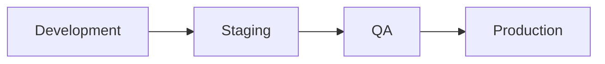

Keep separate:

* API environments;
* storage buckets;
* AI credentials;
* billing products;
* databases.

---

# 36. Observability

Useful diagnostics:

```ts
export interface Diagnostic {
  code: string;
  severity: "info" | "warning" | "error";
  feature?: string;
  screen?: string;
  message: string;
}
```

Monitor:

* AI failures;
* upload failures;
* AR initialization failures;
* quote generation failures;
* billing failures;
* storage failures.

Avoid logging sensitive room imagery or secrets.

---

# 37. Failure Recovery

Every workflow should handle:

```text
Idle
↓
Loading
↓
Success
```

and:

```text
Loading
↓
Error
↓
Retry
↓
Fallback
```

AR fallback:

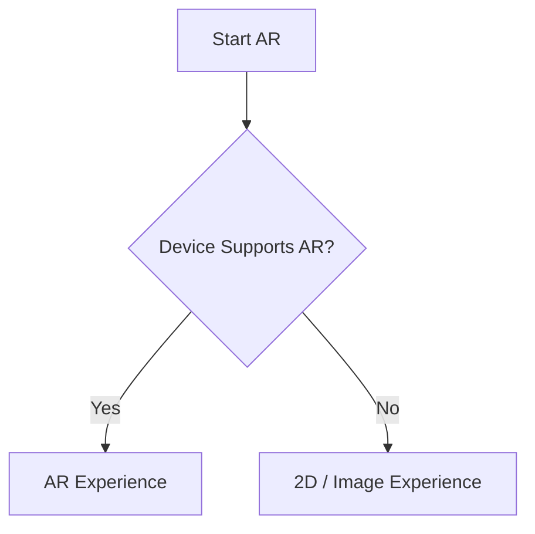

AI fallback can use:

* retry;
* alternate provider;
* lower-resolution generation;
* saved prior result;
* manual editing.

---

# 38. Unsupported AR Devices

AR is an advanced layer, not the only product.

When AR is unavailable, users should still have access to:

* AI image design;
* image editing;
* shopping;
* room understanding;
* construction planning.

This broadens compatibility.

---

# 39. AI Cost Controls

Potential AI cost controls:

* cache repeated requests;
* reuse embeddings;
* compress inputs;
* route simple prompts to lower-cost models;
* reserve expensive image models for premium workflows;
* use asynchronous jobs;
* use credit consumption rules.

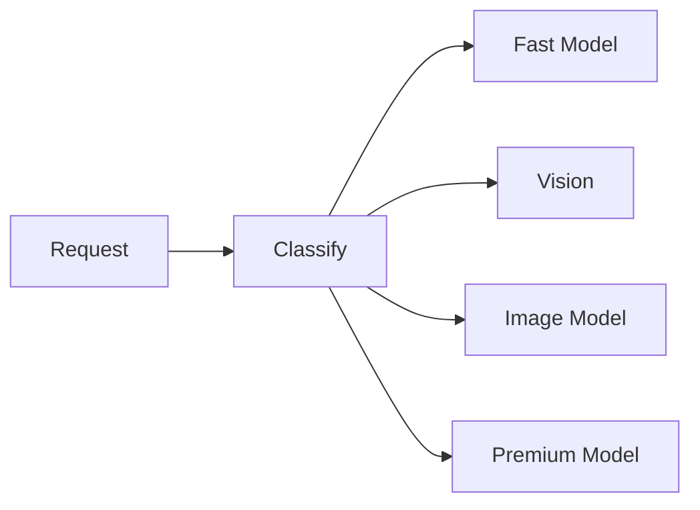

---

# 40. Feature Flags

Use controlled rollout:

```ts
export const FEATURES = {
  ar: true,
  aiVoice: true,
  aiCritic: true,
  shopping: true,
  constructionQuotes: true,
  collaboration: false,
  professionalMode: true,
};
```

Feature flags allow features to be enabled progressively.

---

# 41. Construction Estimate Disclaimer

Construction functionality must remain transparent.

Recommended product language:

> **Planning estimate only.** Quantities and prices are generated from available measurements, assumptions, selected materials, labor inputs, and other project information. Confirm final measurements, scope, permits, material availability, site conditions, labor rates, and pricing with a qualified professional or contractor before beginning work.

The app should allow users to edit quantities and rates.

---

# 42. Roadmap

## Phase 1 — Mobile Core

* React Native
* onboarding
* camera
* room management
* AI generation

## Phase 2 — AI Designer

* multimodal room understanding;
* style reasoning;
* AI editor;
* conversational refinement.

## Phase 3 — AR

* plane detection;
* hit testing;
* anchors;
* furniture placement;
* room measurements.

## Phase 4 — Commerce

* product matching;
* alternative products;
* affiliate links;
* shopping lists.

## Phase 5 — Construction

* measurements;
* scope generation;
* estimates;
* contractors;
* quotes.

## Phase 6 — Advanced AI

* voice AR;
* multi-agent design;
* automatic critique;
* layout optimization;
* whole-home style memory.

## Phase 7 — Platform

* professional workflows;
* team accounts;
* collaboration;
* marketplace;
* API integrations.

---

# 43. Contribution Guide

When adding a feature:

1. Reuse existing abstractions.
2. Avoid creating duplicate APIs.
3. Add mobile UI.
4. Add loading and failure states.
5. Add tests.
6. Consider accessibility.
7. Consider offline behavior.
8. Add server validation where needed.
9. Add documentation.
10. Verify the physical-device flow when AR is involved.

Pull requests should include:

* feature summary;
* mobile screenshots;
* technical explanation;
* testing instructions;
* API/database changes;
* known limitations.

---

# 44. Product Philosophy

RE:ROOM AI should not feel like a collection of disconnected AI demos.

Every capability should strengthen the same core loop.

```text
REAL ROOM
   ↓
UNDERSTAND
   ↓
DESIGN
   ↓
VISUALIZE
   ↓
EDIT
   ↓
SHOP
   ↓
BUILD
```

The product should minimize the distance between:

> "I have an idea."

and:

> "I can see it."

Then:

> "I can place it."

Then:

> "I can buy it."

Then:

> "I can build it."

That continuity is the fundamental product concept.

---

# 45. Final Architecture Summary

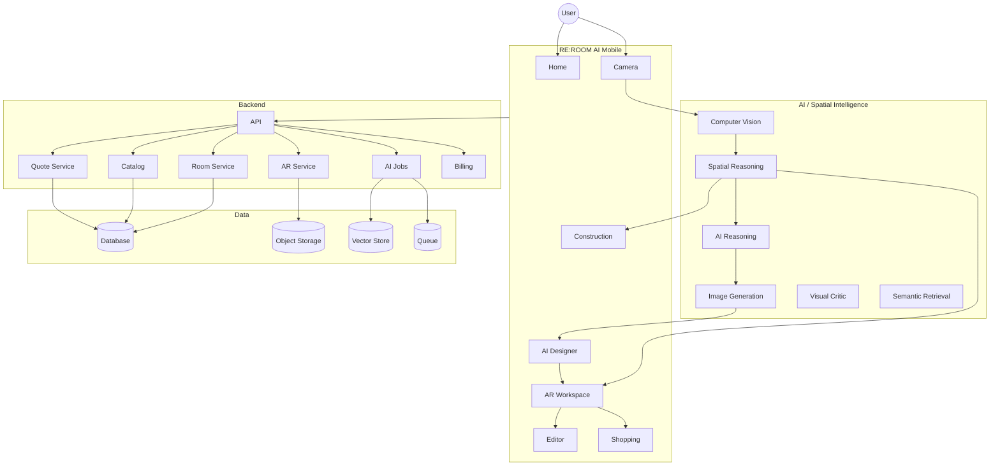

---

# Final Product Story

A user photographs a room.

The system understands:

* what is there;
* where it is;
* how the space is shaped;
* what the user wants;
* what the user wants to keep;
* what the user is willing to spend.

The AI generates design possibilities.

The user walks into AR.

They see the proposed furniture in their real environment.

They say:

> "Make the sofa smaller."

The system changes it.

They say:

> "Try a warmer wood."

The system changes the material.

They ask:

> "What can I actually buy?"

The system returns product candidates.

They then ask:

> "What would it cost to renovate this room?"

The system converts the room into a planning-oriented scope.

They request contractor quotes.

The visual concept has now become a real-world project.

---

# RE:ROOM AI

## **See it. Design it. Place it. Buy it. Build it.**

The central idea is simple:

> **AI should not only imagine your space. It should help you act on it.**

That is the architecture and product direction of RE:ROOM AI.
